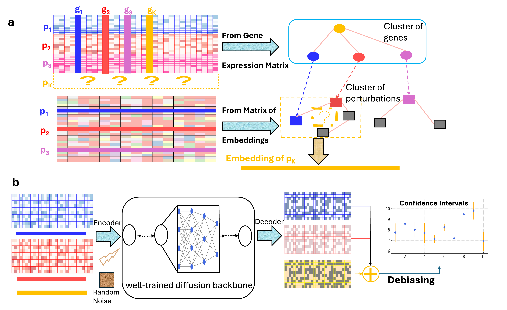
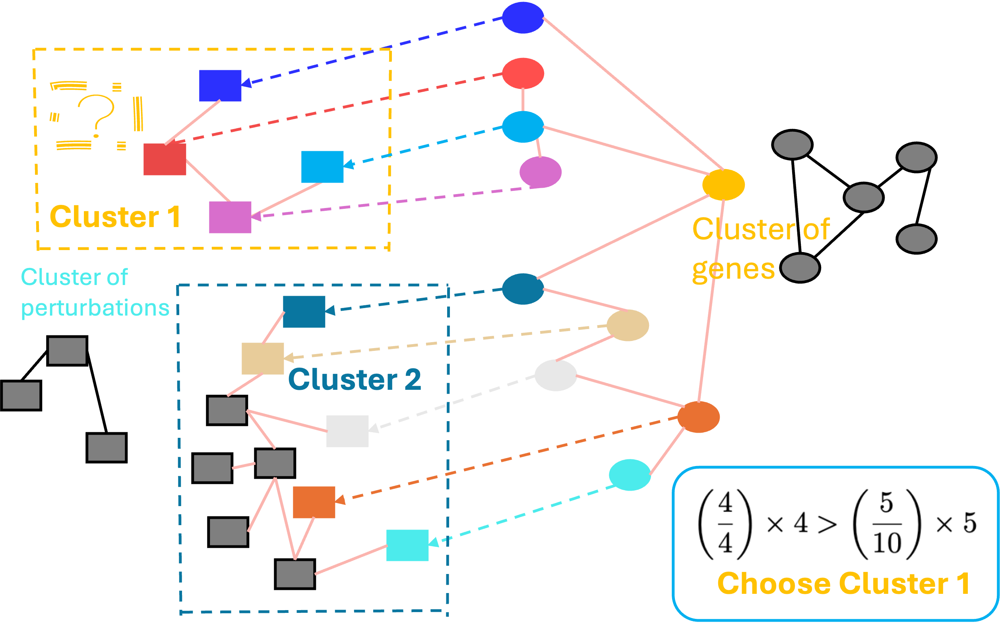

# **Predicting the unseen: a diffusion-based debiasing framework for transcriptional response prediction at single-cell resolution**


This repository provides codes for conducting dbDiffusion in predicting unseen perturbations, which exploits biological similarities in gene expression profiles and relationships among perturbations.

dbDiffusion model is a generative framework that integrates diffusion models with classifier-free guidance derived from perturbation information, operating in latent space through a variational autoencoder (VAE).



## **Train the dbDiffusion Model**


* Step 1: Get the clusters of perturbations and clusters of genes, and estimate the embedding of the unobserved perturbation. Run `functions/classifier_free/get_cluster_for_pert.py'. You need to point out the matrix for embeddings. That matrix could be PCA of a effect size matrix or pseudo-bulk cells. `functions/02_cluster_from_embeddings.py' demonstrates how to use the embeddings after PCA to get clusters of perturbations by Leiden's algorithm. In this procedure, we have no data such as gene expressions or effect sizes under the target perturbation.

* Step 2: Train the Autoencoder. Run `functions/classifier_free/VAE/VAE_train.py`. You need to point out the training data, which should be in `.h5ad` format, where `adata.obs` contains cell type information. The `adata.obs['celltype']` values do not need to follow a specific format like `ctrl+A` (where `A` is a perturbation).  
They can be any labels you like, for example:

```python
adata.obs['celltype'] = ['non-targeting', 'ZC3H13', ...]
```

This data does not contain information of cells under the target perturbation. The pretrained VAE could be found in https://zenodo.org/records/8286452.

* Step 3: Train the diffusion model. Run `functions/classifier_free/cell_train.py`. Through the codes, this file will generate embeddings for each cell in the data excluding cells under the target perturbation before formally training the diffusion model. The dictionary containing embeddings of each cell type has been generated during Step 1.

## **Sampling and Debiasing**

* Run `functions/classifier_free/cell_sample.py`. This file will not only generate samples under the target perturbation according to its embedding calculated in Step 1, but also will generate samples of perturbations that are neighbors of the target perturbation. Those neighbors are also estimated according Step 1. Those samples are still in the latent space.
* Run `functions/classifier_free/UMAP/umap_script_wo_pert.py`. This file will use the trained VAE from Step 2 to transform the samples in latent space to real cells and also produce UMAP for visualization.
* Run `functions/debiasing_and_record/record_all.py`. This file will use neighbors estimated for the target perturbation to conduct debiasing. The results will contain mean predictions along with the standard deviation for constructing confidence intervals.


